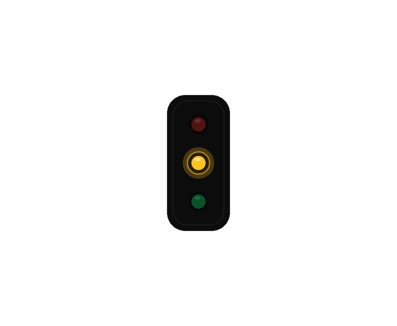
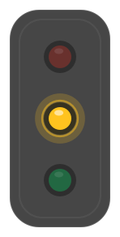
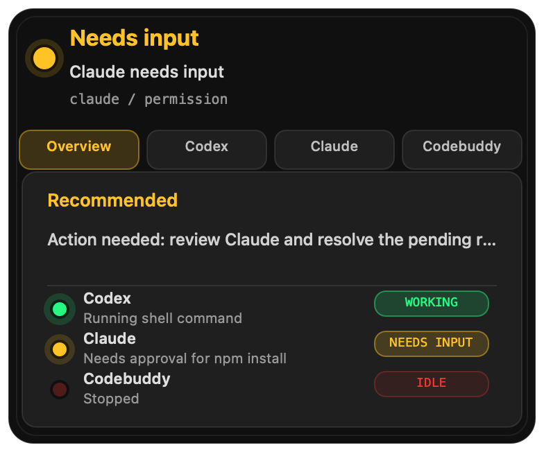
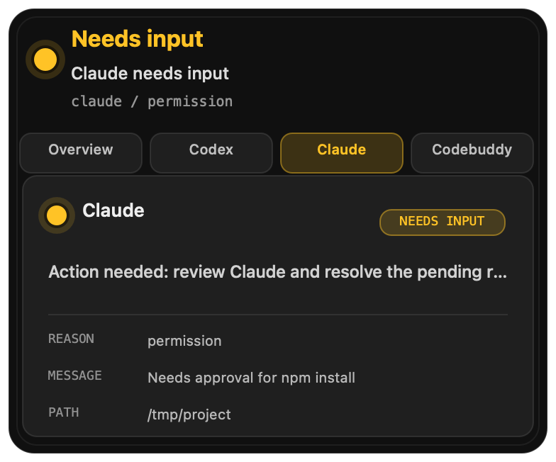

# Agent Traffic Light

[](https://github.com/chenyueling/agent-traffic-light/actions/workflows/ci.yml)
[](LICENSE)
[](Package.swift)
[](Package.swift)

[English](README.md)

一个 macOS 悬浮状态灯，用红 / 黄 / 绿显示 Codex、Claude、CodeBuddy 等 Coding Agent 的实时工作状态。

Agent 正在工作时，灯是绿色；需要你批准权限或继续输入时，灯变黄色；空闲、停止或异常时，灯回到红色系。它适合同时运行多个 coding agent、又不想反复切窗口确认“它到底还在干活还是已经卡住了”的人。



## 下载

直接从 GitHub Releases 下载最新版 app：

[下载 AgentTrafficLight.zip](https://github.com/chenyueling/agent-traffic-light/releases/latest/download/AgentTrafficLight.zip)

像普通 macOS app 一样安装：

1. 解压 `AgentTrafficLight.zip`。
2. 把 `AgentTrafficLight.app` 拖到 `/Applications`。
3. 打开 app。
4. 右键悬浮灯，选择 **Install Hooks…**。

如果 macOS 拦截 app，可以右键 `AgentTrafficLight.app`，选择 **Open**，再确认一次。当前 Release 已做 ad-hoc 签名，但还没有 Apple Developer ID 公证，所以在正式签名版本出来前，这是预期情况。

如果 macOS 提示 app “damaged”，先删除旧的 app 和 zip，重新下载最新版并拖到 `/Applications`。如果仍然被 quarantine 拦截，可以运行：

```bash
xattr -dr com.apple.quarantine /Applications/AgentTrafficLight.app
open /Applications/AgentTrafficLight.app
```

## 预览

悬浮灯可以保持紧凑，也可以在悬停时展开，分别显示每个 agent 的状态。





单个 agent 的详情页会显示状态、原因、消息和当前工作目录。



## 功能

- 独立追踪多个 agent：Codex、Claude、CodeBuddy、Gemini、Cursor、Windsurf，也支持自定义 agent。
- 将所有 agent 聚合成一个悬浮红绿灯。
- 显示实用状态：工作中、需要输入、空闲、异常。
- 为支持的 agent 安装生命周期 hooks。
- 可从悬浮窗打开对应 agent app。
- 能识别额度不足、rate limit、429 等失败状态，避免一直误显示为绿色工作中。

## 状态颜色

| 颜色 | 状态 | 含义 |
|---|---|---|
| 红色 | `idle` | Agent 停止或空闲。 |
| 绿色 | `working` | Agent 正在工作。 |
| 黄色 | `blocked` | 需要人工输入、批准或授权。 |
| 红色脉冲 | `error` | 异常、额度不足、rate limit 或其它错误。 |

聚合优先级：

```text
error / blocked > working > idle
```

只要任意 agent 需要处理，主灯就会立刻提示。

## 快速开始

普通用户：

1. 下载 [AgentTrafficLight.zip](https://github.com/chenyueling/agent-traffic-light/releases/latest/download/AgentTrafficLight.zip)。
2. 解压后把 `AgentTrafficLight.app` 拖到 `/Applications`。
3. 打开 app。如果 macOS 拦截，右键 app 选择 **Open**。
4. 右键悬浮灯，选择 **Install Hooks…**。
5. 如果使用 Codex，在 Codex 里执行 `/hooks`，review/trust 新增 hook。
6. 给 agent 发一条新 prompt，验证灯是否正常变化。

预期表现：

- 新 prompt 开始：绿色。
- 需要权限或输入：黄色。
- 工作结束：红色/空闲。
- 额度不足、429、rate limit 或 usage limit：异常红色。

如果灯没有变化，右键悬浮灯选择 **Diagnostics…**。也可以运行：

```bash
/Applications/AgentTrafficLight.app/Contents/MacOS/AgentTrafficLight --diagnostics
```

## 开发者设置

从源码构建并安装：

```bash
make install
```

然后打开：

```text
/Applications/AgentTrafficLight.app
```

开发时从源码运行：

```bash
swift run AgentTrafficLight
```

创建可分发 zip：

```bash
make dist
```

产物路径：

```text
.build/release/AgentTrafficLight.zip
```

> 当前构建默认是 arm64-only，且使用 ad-hoc 签名，但还没有 Apple Developer ID 公证。自用或小范围试用没问题；正式公开分发建议补 universal2 构建、Developer ID 签名和 notarization。

发布 GitHub Release 时，推送一个版本 tag：

```bash
git tag v0.1.0
git push origin v0.1.0
```

Release workflow 会自动构建并上传 `AgentTrafficLight.zip`。

## 支持的集成

App 会为已配置的 agent 安装 hooks：

| Agent | Hook 文件 |
|---|---|
| Codex | `~/.codex/hooks.json` |
| Claude | `~/.claude/settings.json` |
| CodeBuddy | `~/.codebuddy/settings.json` |

Hook 安装是显式操作。App 启动时不会静默修改这些文件。

也可以用命令行安装：

```bash
swift run AgentTrafficLight --install-hooks
```

卸载 Agent Traffic Light 安装过的 hooks：

```bash
swift run AgentTrafficLight --uninstall-hooks
```

也可以右键悬浮灯，选择 **Uninstall Hooks…**。

安装和卸载前都会创建带时间戳的 `.traffic-light.*.bak` 备份。

## 诊断

如果状态信号没有到达，使用 **Diagnostics…**。报告会检查：

- 本地服务和端口。
- 配置文件。
- Hook 脚本。
- Codex、Claude、CodeBuddy 的 hook 文件。
- Hooks 是否已安装。
- 每个 agent 的最近状态和最近信号时间。

提交 issue 时，可以在诊断窗口点击 **Copy Report**。

## 手动更新状态

使用 helper 脚本：

```bash
./bin/agent-light-update working codex prompt "Codex started"
./bin/agent-light-update blocked claude permission "Claude needs approval"
./bin/agent-light-update idle codebuddy stop "CodeBuddy stopped"
```

或者直接请求本地 HTTP 服务：

```bash
curl -s -X POST http://127.0.0.1:17361/status \
  -H 'Content-Type: application/json' \
  -d '{"state":"working","agent":"my-agent","reason":"prompt","message":"Processing..."}'
```

读取当前状态：

```bash
curl -s http://127.0.0.1:17361/status
```

## 配置

首次启动时，app 会创建：

```text
~/.agent-traffic-light/config.json
```

示例：

```json
{
  "port": 17361,
  "installHooksOnLaunch": false,
  "agents": [
    { "id": "codex", "displayName": "Codex" },
    { "id": "claude", "displayName": "Claude" },
    { "id": "codebuddy", "displayName": "CodeBuddy" }
  ]
}
```

字段说明：

| 字段 | 含义 |
|---|---|
| `port` | 本地 HTTP 服务端口，修改后需要重启。 |
| `installHooksOnLaunch` | 是否在 app 启动时安装 hooks，默认 `false`。 |
| `agents` | UI 中显示、API 中可更新的 agent 列表。 |

你可以添加新的 `{ "id": "...", "displayName": "..." }` 来支持自定义 agent，然后用这个 `id` 上报状态。

## 交互

- 拖动紧凑灯可以移动位置。
- 松手后会吸附到屏幕边缘。
- 悬停展开详情。
- 使用 tab 查看单个 agent。
- 右键可打开设置、安装 hooks、固定窗口、手动切状态或退出。
- 选择 **Open Agent** 可以打开对应 app。

## 工作原理

Agent Traffic Light 会运行一个很小的本地服务：

```text
http://127.0.0.1:17361/status
```

Agent hooks 调用一个 shell 脚本，把生命周期事件上报到本地服务。App 为每个 agent 单独保存状态，并渲染聚合后的红绿灯。

```text
Agent hook -> traffic-light-hook.sh -> local HTTP server -> floating macOS UI
```

## 系统要求

- macOS 14.0+
- Swift 6.0，仅源码构建需要

## Roadmap

- 签名和公证后的 release。
- Universal2 release 构建。
- Homebrew cask。
- Hook 安装和状态聚合测试。

## License

MIT
